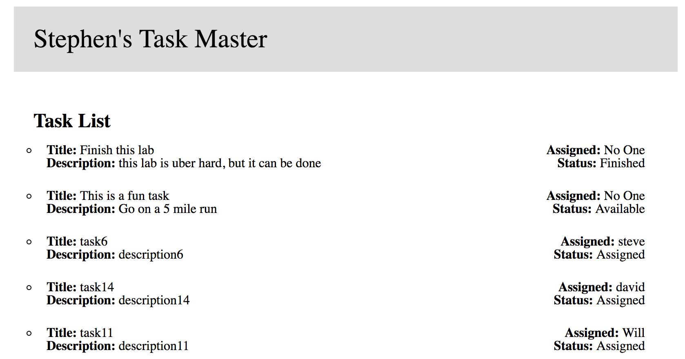

# Task Master Frontend

This is a Code Fellows project. It is the frontend to the for a site that handles tasks.

## Link to Deployed Site
[Task Master Frontend](http://stephenc-task-master.s3-website-us-west-2.amazonaws.com/)

## Description
This website provides a UI to interact with the Task Master API backend located [here](https://github.com/stephenchu530/taskmaster)

You can do the following:

* View all tasks by all users (default view)
  * Filter the view based on an assigned user
  * Filter the view based on the status of the task (`Available`, `Assigned`, `Accepted`, or `Finished`)
* Add and upload an image related to the task
* Create a new task
  * Must have a `title`
  * Must have a `description`
  * With an assigned person (`status` will be `Assigned`)
  * Without an assigned person (`status` will be `Available`)
* Delete a task
  

## Contributors
* Stephen Chu, [stephenchu530](https://github.com/stephenchu530)

## License

